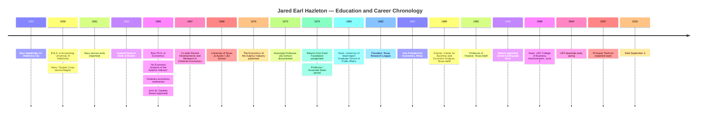

# Jared Earl Hazleton: Education and Professional Milestone Validation Report

## Executive summary

The documentary record supports a coherent chronology for Dr. Jared Earl Hazleton, but several dates in the current TexEcon biography and family obituary should be corrected or qualified.

The most important finding concerns his Rice doctorate. **Rice University's own institutional repository catalogs Jared Earl Hazleton's dissertation, “An Economic Analysis of the Sulphur Industry,” as a 1965 Rice University dissertation.** That is substantially stronger evidence than the **1961** date currently shown on TexEcon or the **1964** date in the longer family obituary. The recommended date for biographical use is therefore **Ph.D. in Economics, Rice University, 1965**, unless a transcript or diploma establishes a different formal conferral date. citeturn6search0

The undergraduate evidence also resolves much of the OU ambiguity. A historical scholarly listing gives **“B.B.A. Oklahoma 1959,”** while UNT's official 1999 announcement describes his undergraduate degree as a **bachelor's degree in accounting**. TexEcon independently gives **BBA, University of Oklahoma, 1959**. Taken together, the best-supported wording is **Bachelor of Business Administration in Accounting, University of Oklahoma, 1959**. I found no comparably authoritative evidence supporting a B.S. designation. citeturn4search8turn33view0turn34search1

His later career chronology is unusually well supported because UNT's March 1999 announcement summarizes his prior career immediately before he became dean. It confirms that he had directed Texas A&M's **Center for Business and Economic Analysis since 1989**, had been a **professor of finance there since 1992**, had previously been **Vice President for Economics at Mesa Limited Partnership**, had served as **President of the Texas Research League**, had held faculty and administrative positions at UT Austin and the LBJ School, and had been **Dean of the University of Washington's Graduate School of Public Affairs**. His UNT appointment was effective **June 1, 1999**. citeturn33view0turn29search0

That official UNT record also reveals an important Texas A&M nuance: the obituary should not imply that he became a finance professor at A&M in 1989. The best evidence says he became **Director of the Center for Business and Economic Analysis in 1989** and **Professor of Finance in 1992**. citeturn33view0

For UNT, the evidence supports **Dean, June 1, 1999–spring 2004**, not “Dean 1999–2007.” A contemporaneous *Chronicle of Higher Education* report published in October 2004 described his term as dean as having ended that spring. TexEcon's 1999–2007 entry appears to combine his deanship with his later UNT faculty service. citeturn29search0turn15search5turn34search1

His University of Washington, Texas Research League, and Mesa sequence is internally consistent as **Washington 1980–1982; Texas Research League 1982–1987; Mesa 1987–1989**, and contemporaneous records independently verify him as Washington dean in the early 1980s, Texas Research League president during the mid-1980s, and affiliated with Mesa by 1987. Exact month-level appointment dates remain unverified. citeturn34search1turn34search11turn25search1turn24search3

His Navy record is less securely documented. TexEcon's biographical chronology gives **Lieutenant, Supply Corps, U.S. Naval Reserve/U.S. Navy, 1959–1961**, while the family/funeral-home history states that he served aboard **USS *Howard D. Crow*** following ROTC at OU. I did not locate an official Navy personnel record, officer register entry, or ship roster tying him to the vessel, so those details should be treated as **highly plausible family/biographical facts, not yet independently verified military-record facts**. citeturn34search1turn31search1

The following formulations are therefore recommended for the permanent biographical record:

| Attribute | Recommended form | Assessment |
|---|---|---|
| Birth | **September 12, 1937, Oklahoma City, Oklahoma** | High confidence |
| Death | **September 3, 2026** | High confidence |
| OU | **B.B.A. in Accounting, University of Oklahoma, 1959** | High confidence; registrar verification still desirable |
| Rice | **Ph.D. in Economics, Rice University, 1965** | Very high confidence; use 1965 rather than 1961/1964 |
| Dissertation | **“An Economic Analysis of the Sulphur Industry”** | Confirmed by Rice |
| Gardner Award | **John W. Gardner Award, apparently 1965** | Strong biographical evidence, but historical Rice winner record still needed |
| Navy | **Supply Corps officer/Lieutenant, 1959–1961; USS *Howard D. Crow*** | Probable; obtain OMPF for definitive confirmation |
| UT/LBJ | **1968–1980; associate dean by late 1970s** | Strong, exact sub-position dates partly biographical |
| Washington | **Dean, Graduate School of Public Affairs, 1980–1982** | Strong, exact endpoints not yet from UW personnel record |
| Texas Research League | **President, 1982–1987** | Strong |
| Mesa | **Vice President for Economics, 1987–1989** | Strong |
| Texas A&M | **Center director 1989–1999; Professor of Finance 1992–1999** | Very strong |
| UNT | **Dean, June 1, 1999–spring 2004** | Strong |
| TexEcon | **Principal from approximately 2007** | Self-reported chronology; website history should be archived |

## Education and military record

### Birth and death

The date **September 12, 1937** is consistently reported by TexEcon and the published memorial material as Jared Earl Hazleton's date of birth in Oklahoma City, Oklahoma. His death on **September 3, 2026**, at age 88 is likewise consistently reported by the family/funeral-home notice, the *Dallas Morning News* obituary distribution, and TexEcon. citeturn34search2turn31search0turn31search1

For an obituary or memorial biography, those dates can safely be used. For a formal archival biography, a birth certificate and Texas death certificate would be the highest-order legal evidence. I did not locate publicly accessible vital records that supersede the family and funeral-home records.

**Recommended entry:**  
**September 12, 1937 – September 3, 2026.**

### University of Oklahoma degree

Three independent strands point to the same underlying degree history. First, TexEcon lists a **Bachelor of Business Administration, University of Oklahoma, 1959**. Second, a historical scholarly listing of doctoral dissertations identifies him as **“JARED E. HAZLETON, B.B.A. Oklahoma 1959.”** Third, UNT's official March 1999 announcement states that he held a **bachelor's degree in accounting from the University of Oklahoma**. citeturn34search1turn4search8turn33view0

The UNT wording explains why some later biographies may simply describe his undergraduate credential as an “accounting degree”: **accounting appears to have been the field/major, while B.B.A. was the degree designation.** That interpretation is reinforced by the older scholarly record, which is chronologically much closer to his graduation than modern web biographies. citeturn4search8turn33view0

I did not find an OU registrar record or digitized 1959 commencement list in the indexed sources searched. Consequently, I would rank the evidence as follows:

**Best biographical wording:** **B.B.A. in Accounting, University of Oklahoma, 1959.**

A later “B.S.” variant should **not** be used unless OU's registrar or commencement records demonstrate that designation. The contemporary/historical evidence available here favors B.B.A. citeturn4search8turn34search1

### Rice doctorate and dissertation

This is the clearest discrepancy in the existing material.

Rice University's institutional repository catalogs:

> Jared Earl Hazleton, **“An Economic Analysis of the Sulphur Industry,” (1965), Dissertation, Rice University.**

Because this is the degree-granting university's own repository record for the dissertation, it should take precedence over family recollection, current TexEcon biography text, commercial book metadata, or later institutional biographies. citeturn6search0

Accordingly:

- **TexEcon's “Ph.D. Economics, Rice, 1961” should be corrected.** citeturn34search1
- **The obituary's “Ph.D. ... 1964” should also be corrected or the year omitted.**
- **1965 is the defensible date for the doctorate based on the strongest documentary evidence now available.** citeturn6search0

There is a plausible source of the confusion: 1961 corresponds to the end of the Navy-service period given in the TexEcon chronology, while Hazleton's Federal Reserve career was already underway by 1964. A dissertation completed while employed is entirely possible; those overlapping dates do not justify backdating the degree. That is an inference from the chronology rather than an independently documented explanation. citeturn6search0turn34search1

**Recommended entry:**  
**Ph.D. in Economics, Rice University, 1965. Dissertation: “An Economic Analysis of the Sulphur Industry.”** citeturn6search0

### John W. Gardner Award

Rice today describes the **John W. Gardner Award** as an award recognizing the best dissertation in the School of Social Sciences. Rice's official Economics and Social Sciences pages confirm the award's purpose and institutional existence. citeturn6search1turn6search2

TexEcon's detailed biography states that Hazleton was a **recipient of the John W. Gardner Award, Rice University, 1965**. That date now makes considerably more sense because Rice's own dissertation record also places the dissertation in 1965. citeturn34search1turn6search0

However, the publicly indexed Rice pages I located do **not** provide a complete historical list of Gardner Award winners reaching back to 1965. Rice's Woodson Research Center also catalogs archival material concerning the Gardner award/medallion, but the public item description does not establish Hazleton as the recipient. citeturn6search4

The appropriate historical wording at present is therefore:

**“His dissertation received Rice University's John W. Gardner Award” — strongly supported, but the family's archival master record should seek direct confirmation from Rice before attaching the exact 1965 award date as a formally verified fact.**

A useful request to Rice would be for the **1965 School of Social Sciences awards list, commencement program, Graduate Council record, or John W. Gardner Award recipient register**.

### ROTC and Navy service

TexEcon's biographical chronology supplies unusually specific military information: **Lieutenant, Supply Corps, U.S. Naval Reserve/U.S. Navy, 1959–1961**. Family and funeral-home material adds that his Navy service followed ROTC at OU and that he served aboard the destroyer escort **USS *Howard D. Crow***. citeturn34search1turn31search1

I did not locate an official personnel record, Navy officer register, muster roll, cruise book, or *Howard D. Crow* roster linking Jared E. Hazleton to the ship. Thus, for a rigorous historical record, three elements remain to be independently documented: **commissioning date, exact rank progression/final rank, and dates aboard USS *Howard D. Crow*.**

There is no reason in the sources reviewed to doubt the family account, but documentary standards matter here. The recommended interim wording is:

**“Following graduation from OU, Hazleton served as a Supply Corps officer in the U.S. Navy/United States Naval Reserve, approximately 1959–1961. Family and biographical records identify his ship as USS *Howard D. Crow* and his rank as lieutenant.”** citeturn34search1turn31search1

For definitive proof, the highest-value next record is his **Official Military Personnel File (OMPF)** from the National Archives' National Personnel Records Center. Given the age of the service, the record should now be archival rather than subject to the same privacy restrictions as recent personnel files. A family-held **DD-214, discharge certificate, commission, orders, or officer fitness report** would resolve the matter even faster.

## Professional chronology

### Federal Reserve Bank of Boston and fisheries economics

TexEcon provides a detailed early-career sequence at the Federal Reserve Bank of Boston:

**Research Economist, 1964–1965; manager of a research department, 1965–1966; banking-services officer, 1966–1968.** citeturn34search1

The Federal Reserve affiliation is independently corroborated by bibliographic records surrounding his fisheries-economics work. *Recent Developments and Research in Fisheries Economics* identifies Jared E. Hazleton as co-editor with Frederick W. Bell and associates the work with the Federal Reserve Bank of Boston. The volume was published by Oceana Publications in **1967**. citeturn30search1turn30search10

The book grew out of papers presented at a **1965 conference on fisheries economics**. TexEcon states that the symposium involved the New England Economic Research Foundation, the U.S. Bureau of Commercial Fisheries, and the Federal Reserve Bank of Boston; contemporaneous/bibliographic records confirm the 1965 conference provenance and the 1967 publication. citeturn34search1turn30search10turn30search6

The precise Fed job-title dates still rest primarily on the biographical chronology rather than Boston Fed personnel files, but the **1964–1968 Federal Reserve affiliation and his fisheries-research role are well supported**. citeturn34search1turn30search1

### University of Texas at Austin and the LBJ School

TexEcon gives the following UT chronology: **lecturer, 1968–1969; associate professor, 1970–1975; professor/associate dean, 1975–1980.** citeturn34search1

Contemporaneous government and university records substantiate the middle and later portions of that sequence. A May **1973** research report prepared under National Science Foundation and Texas Governor's Office sponsorship names **Jared E. Hazleton, Associate Professor of Public Affairs, LBJ School of Public Affairs, University of Texas at Austin**, and identifies him as a co-principal investigator. citeturn34search4turn34search5

An additional UT repository record identifies him as **Associate Dean, LBJ School of Public Affairs**, while UT System Board of Regents material from the late 1970s identifies him as a professor in the LBJ School. citeturn34search10turn16search25

UNT's 1999 institutional biography independently summarizes his UT record: he was **vice chair of the economics department**, served on the **LBJ School faculty**, and served as **associate dean of the LBJ School**. It also says he took leave from UT from **1973 to 1975** for Ford Foundation work at the Royal Scientific Society in Amman, Jordan. citeturn33view0

The evidence therefore supports **UT Austin/LBJ School, 1968–1980** as the best current overall range, with especially strong direct documentation from 1973 through the late 1970s. The exact lecturer-to-associate-professor transition years still depend on the biographical chronology and could be confirmed against UT faculty appointment records. citeturn34search1turn34search5turn34search10

### University of Washington

TexEcon gives **1980–1982** for Hazleton's University of Washington service as professor/dean. UNT's official 1999 profile confirms that he was **Dean of the University of Washington's Graduate School of Public Affairs** during the early-1980s phase of his career. citeturn34search1turn33view0

A contemporaneous 1981 policy-council record associates Hazleton with the University of Washington and identifies him in a dean capacity, while an Alfred P. Sloan Foundation annual-report archive identifies “Jared Hazleton” as **Dean, Graduate School of Public Affairs** in material covering the 1979–1982 period. citeturn34search11turn34search15turn34search18

By 1986, Angelo State University's official Distinguished Speaker Series described him as **President of the Texas Research League and former Dean of the Graduate School of Public Affairs at the University of Washington**. citeturn34search16turn34search17

I did not locate an indexed UW Board of Regents appointment notice or faculty personnel record giving start and termination dates. Therefore **1980–1982 is the best-supported range but should be characterized as biographically established rather than registrar-level confirmed**. The evidence firmly verifies the deanship itself. citeturn34search1turn33view0

### Texas Research League and Mesa Petroleum

TexEcon places Hazleton as **President of the Texas Research League from 1982 to 1987**. Contemporaneous evidence strongly supports that interval. A 1983 professional-meeting program identifies him with the Texas Research League, and an April **1986** Texas Research League publication lists its officers with **Jared E. Hazleton, President**. citeturn24search7turn25search1

The latter is particularly valuable because it is effectively a first-party organizational record. A scanned copy is available through the UNT Portal to Texas History:

`https://texashistory.unt.edu/ark:/67531/metapth1543477/m2/1/high_res_d/UNT-0005-0548.pdf`

The first page visibly identifies him as president. The web PDF renderer timed out when I attempted to capture a separate page screenshot, but the full archival scan is accessible at the link and its text is indexed by UNT. citeturn25search1

TexEcon dates his next position, **Vice President for Economics, Mesa Limited Partnership, Amarillo**, to **1987–1989**. UNT's 1999 institutional biography independently confirms the exact title and states that the Mesa position preceded his move to Texas A&M. citeturn34search1turn33view0

A Texas strategic-economic-planning record from the period also identifies **Dr. Jared Hazleton, Mesa Petroleum** among participants in the state's planning process, independently confirming a Mesa affiliation in **1987**. citeturn24search3turn26search10

Taken together, the sequence **Texas Research League, 1982–1987 → Mesa Petroleum, 1987–1989** is strong. The exact month of each transition remains unverified.

### Texas A&M University

This milestone can be dated more precisely than the obituary currently does.

UNT's official March 1999 appointment announcement says:

- Hazleton had been **Director of the Center for Business and Economic Analysis in Texas A&M's Lowry Mays College and Graduate School of Business since 1989**.
- He had been **Professor of Finance since 1992**.
- He taught undergraduate and graduate corporate-finance and money-and-capital-markets courses. citeturn33view0

The summer 1999 issue of *The North Texan* repeats that he had directed the center **since 1989** and records his move to UNT effective June 1, 1999. citeturn29search0

This leads to a useful correction to the current obituary wording. Instead of:

> “In 1989, Jared joined Texas A&M ... as Director ... He also served as a professor of finance...”

which could be read as both appointments beginning in 1989, the historically precise version is:

> **“In 1989, Jared joined Texas A&M University's Lowry Mays College and Graduate School of Business as Director of the Center for Business and Economic Analysis. In 1992, he also became a professor of finance.”**

That distinction comes directly from UNT's contemporaneous institutional biography. citeturn33view0

The defensible ranges are therefore:

**Director, Center for Business and Economic Analysis: 1989–1999.**  
**Professor of Finance: 1992–1999.** citeturn33view0turn29search0

### University of North Texas

UNT's own March 1999 employee publication announced Hazleton's selection as dean and specified that the appointment, subject to Board of Regents confirmation, would be **effective June 1, 1999**. The summer 1999 *North Texan* subsequently stated that he **began work at UNT June 1**. citeturn33view0turn29search0

The original scanned institutional announcement can be viewed here:

`https://digital.library.unt.edu/ark:/67531/metadc2644052/m1/3/`

It is one of the most information-dense primary records found in this research because it simultaneously documents his UNT appointment, Texas A&M dates, Mesa title, Texas Research League presidency, earlier UT/LBJ and Washington roles, advisory work, and educational fields. citeturn33view0

The end of the deanship is important because TexEcon currently states **“Professor, finance, dean University North Texas, Denton, 1999–2007.”** That construction is misleading. A *Chronicle of Higher Education* report published October 1, 2004 referred to Hazleton as the former dean and stated that **his term as dean ended in the spring of 2004**. citeturn15search5turn34search1

UNT catalogs independently show him serving as dean during the intervening years, including 2002–2003. citeturn14search3

The best-supported formulation is therefore:

**Dean, College of Business Administration, University of North Texas: June 1, 1999–spring 2004.**

He remained associated with UNT after leaving the deanship; that appears to be the likely origin of the later **1999–2007** composite date. The evidence does **not** support calling him dean through 2007. citeturn15search5turn34search1

### TexEcon

The current TexEcon biography describes Hazleton as **Principal of TexEcon since 2007** and as its principal/lead economics author. The site's current memorial/archive presents TexEcon as the vehicle through which he continued economic analysis and commentary later in life. citeturn34search1turn34search2

I found indications of a **2006** copyright history on the site, but a website copyright date is not reliable evidence of the date a consultancy began. Accordingly, **“Principal, TexEcon, from 2007”** is the most defensible current statement because it is the date explicitly supplied by Hazleton's own biographical chronology. citeturn34search1

For a permanent digital archive, the next useful step is to preserve dated snapshots of early TexEcon pages from the Internet Archive and compare them with corporate/assumed-name filings, tax records, or contemporaneous correspondence if the precise founding date matters.

## Public-policy roles and publications

### Advice to Bob Bullock and the Texas House

UNT's March 1999 official profile expressly states that Hazleton's professional experience included service **“as an adviser on state tax policy to Texas Lt. Gov. Bob Bullock and the Texas House Select Committee on Taxation.”** Because this was published by UNT at the time of his recruitment, while Hazleton and the hiring administration could readily have corrected the biography, it is good institutional evidence for the role itself. citeturn33view0

The search also produced a date-specific contemporaneous example. The November 8, **1995** *Aransas Pass Progress*, reproducing a Texas political-news report, described Hazleton as a **Texas A&M finance professor named to a school-funding task force by Lt. Gov. Bob Bullock**. The task force was examining alternatives for funding Texas public schools and property-tax relief. citeturn25search2

That 1995 record directly confirms **a Bullock-appointed advisory role**. It does not, however, prove that this school-funding task force was identical to the “Texas House Select Committee on Taxation” mentioned by UNT. Those should therefore remain separate entries unless a legislative document connects them. citeturn25search2turn33view0

The current evidentiary status is:

**Bob Bullock:** confirmed; specifically documented in a Bullock-appointed school-funding/tax-policy task force by November 1995. citeturn25search2

**Texas House Select Committee on Taxation:** role confirmed by UNT's official 1999 biography, but I did **not** locate the committee roster, appointment letter, report, hearing transcript, or exact service dates in the indexed Texas legislative materials searched. citeturn33view0

For the latter, the strongest next targets are the **Texas Legislative Reference Library**, Texas House committee archives for the relevant legislative sessions, and the **Bob Bullock papers**. Searching 1993–1997 committee rosters and tax/school-finance working papers should be especially productive given the independently documented 1995 task-force service.

### Fisheries economics publication

The bibliographic evidence supports the following citation:

**Frederick W. Bell and Jared E. Hazleton, eds., *Recent Developments and Research in Fisheries Economics*, Oceana Publications, 1967.** citeturn30search1turn30search6turn30search10

The U.S. government/EPA bibliographic record likewise lists Hazleton and Bell, the title, Oceana Publications, Dobbs Ferry, New York, and **1967**. citeturn30search8

The book comprised papers from a **1965 fisheries-economics conference**, linking this publication directly to Hazleton's Federal Reserve Bank of Boston period. citeturn30search10turn34search1

The title should be rendered **Recent Developments and Research in Fisheries Economics**. The current TexEcon page reverses the first two nouns in one heading (“Recent Research and Developments…”), but its descriptive text and external bibliographic records support the published title above. citeturn34search1turn30search1

### *The Economics of the Sulphur Industry*

The book publication should be distinguished from the dissertation.

Rice records the dissertation **“An Economic Analysis of the Sulphur Industry” in 1965**. citeturn6search0

The substantially developed book **The Economics of the Sulphur Industry** was originally published in **1970**, associated with Resources for the Future and The Johns Hopkins Press. Bibliographic references contemporary to the literature cite Hazleton's book as a **1970** Johns Hopkins Press/Resources for the Future publication, and modern republication metadata explicitly describes the work as originally published in 1970. citeturn30search5turn30search7turn30search13

Thus the correct sequence is:

**1965 — Rice dissertation, *An Economic Analysis of the Sulphur Industry*.** citeturn6search0  
**1970 — book, *The Economics of the Sulphur Industry*.** citeturn30search5turn30search13

Those dates should not be conflated.

## Consolidated timeline and source assessment

The following table distinguishes between facts that are directly documented and dates that rely partly on a later biographical chronology. “Confirmed” means that a contemporaneous or official institutional/government record was found; it does not necessarily mean a personnel file or legal certificate was obtained.

| Date | Milestone | Assessment and principal evidence |
|---|---|---|
| **Sep. 12, 1937** | Born, Oklahoma City, Oklahoma | **High confidence.** Consistent TexEcon and published/funeral-home records. citeturn34search2turn31search1 |
| **1959** | University of Oklahoma | **Best supported:** **B.B.A. in Accounting**, graduated 1959. Historical dissertation listing says B.B.A. Oklahoma 1959; UNT says bachelor's degree in accounting. citeturn4search8turn33view0 |
| **1959–1961** | U.S. Navy / Naval Reserve, Supply Corps | **Probable, not military-record confirmed.** TexEcon says Lieutenant, Supply Corps, 1959–61; family history identifies USS *Howard D. Crow*. citeturn34search1turn31search1 |
| **1965** | Rice University Ph.D. | **Confirmed by Rice repository.** Ph.D. dissertation: “An Economic Analysis of the Sulphur Industry.” Use **1965**, not 1961 or 1964. citeturn6search0 |
| **1965** | John W. Gardner Award | **Strong but incompletely independently verified.** TexEcon says recipient in 1965; Rice confirms nature/existence of award but indexed historical winner list was not found. citeturn34search1turn6search1 |
| **1964–1968** | Federal Reserve Bank of Boston | **Strong.** Detailed job chronology comes from biographical source; Fed affiliation independently supported by fisheries work/bibliography. citeturn34search1turn30search1 |
| **1965** | Fisheries-economics conference | **Confirmed bibliographically.** Papers later formed the 1967 volume. citeturn30search10 |
| **1967** | *Recent Developments and Research in Fisheries Economics* | **Confirmed.** Co-edited with Frederick W. Bell; Oceana Publications. citeturn30search1turn30search8 |
| **1968–1980** | University of Texas at Austin / LBJ School | **Strong range; sub-role dates partly biographical.** Primary 1973 report shows Associate Professor of Public Affairs; UT records later show Associate Dean. citeturn34search5turn34search10turn34search1 |
| **1973–1975** | Ford Foundation / Royal Scientific Society, Amman | **Institutionally corroborated by UNT biography.** Included here for continuity although not a requested validation target. citeturn33view0 |
| **1970** | *The Economics of the Sulphur Industry* | **Confirmed bibliographically.** Original book publication, Resources for the Future/Johns Hopkins Press. citeturn30search5turn30search13 |
| **1980–1982** | Dean, University of Washington Graduate School of Public Affairs | **Title confirmed; exact years strong but not yet from UW personnel file.** TexEcon chronology plus contemporaneous and later institutional references. citeturn34search1turn34search11turn33view0 |
| **1982–1987** | President, Texas Research League | **Strong.** Chronology gives 1982–87; contemporary 1983 and 1986 records confirm service, including first-party 1986 newsletter. citeturn34search1turn24search7turn25search1 |
| **1987–1989** | Vice President for Economics, Mesa Limited Partnership/Petroleum | **Strong.** UNT confirms title and sequence; state planning record confirms Mesa affiliation in 1987. citeturn33view0turn24search3 |
| **1989–1999** | Director, Center for Business and Economic Analysis, Texas A&M | **Confirmed by contemporaneous UNT announcement.** “Since 1989” immediately before his 1999 departure. citeturn33view0turn29search0 |
| **1992–1999** | Professor of Finance, Texas A&M | **Confirmed.** UNT says professor of finance **since 1992**, correcting any implication that professorship began in 1989. citeturn33view0 |
| **1995** | Bullock-appointed school-funding/tax task force | **Confirmed contemporaneously.** Newspaper record says appointed by Lt. Gov. Bob Bullock. citeturn25search2 |
| **By 1999** | Adviser on state tax policy to Bullock and Texas House Select Committee on Taxation | **Role confirmed by UNT; exact House committee dates/document unresolved.** citeturn33view0 |
| **Jun. 1, 1999** | Became Dean, UNT College of Business Administration | **Confirmed by UNT.** Appointment explicitly effective June 1; later UNT publication says he began that date. citeturn33view0turn29search0 |
| **Spring 2004** | Ended UNT deanship | **Strong contemporary-news evidence.** *Chronicle of Higher Education* described term as ending that spring. citeturn15search5 |
| **c. 2007 onward** | Principal, TexEcon | **Self-reported chronology.** TexEcon gives “since 2007”; exact founding/start date still needs archival website/business-record confirmation. citeturn34search1 |
| **Sep. 3, 2026** | Died | **High confidence.** Family/funeral-home, published obituary, and TexEcon agree. citeturn31search0turn31search1turn34search2 |

The career can be visualized as follows. Solid dates correspond to the best-supported chronology in the table; the Washington, Texas Research League, Mesa, early Fed, Navy, and TexEcon endpoints still warrant personnel/archive verification at a finer level. citeturn6search0turn33view0turn34search1turn25search1turn29search0



The source hierarchy matters when resolving conflicts. For this project I would use **degree-granting university records and contemporaneous institutional/government documents first**, then contemporaneous archival news, then later institutional biographies, and only after those TexEcon/family retrospective material. Under that hierarchy, **Rice 1965 overrides TexEcon 1961 and the obituary's 1964; B.B.A. in Accounting, 1959 is preferable to B.S.; and UNT dean 1999–spring 2004 overrides TexEcon's composite 1999–2007 dean/faculty entry.** citeturn6search0turn4search8turn33view0turn15search5turn34search1

## Methods, unresolved items, and recommended archival actions

### Research method and databases

Research emphasized primary and near-primary sources, with later biographies used primarily to establish leads and then tested against contemporaneous evidence. Searches covered the **Rice University institutional repository and School of Social Sciences**, **University of Texas System records and UT repository**, **U.S. government information via GovInfo**, **University of North Texas Digital Library and Portal to Texas History**, **Texas A&M institutional material**, **University of Washington digital collections**, **Texas state archival/planning material**, **Alfred P. Sloan Foundation annual reports**, bibliographic/library records, historical scholarly indexes, contemporary newspaper archives, and **TexEcon**. citeturn6search0turn34search5turn33view0turn25search1turn34search15

Representative queries included:

```text
"Jared Earl Hazleton" Rice dissertation
"AN ECONOMIC ANALYSIS OF THE SULPHUR INDUSTRY" Hazleton
"Jared E. Hazleton" Oklahoma BBA 1959
site:utsystem.edu "Jared Hazleton" LBJ School
site:govinfo.gov "Jared E. Hazleton" "LBJ School"
"Jared Hazleton" "Graduate School of Public Affairs" Washington
"Jared Hazleton" "Texas Research League"
"Jared Hazleton" "Mesa Petroleum" economics
site:tamu.edu "Jared Hazleton" "Center for Business and Economic Analysis"
site:unt.edu "Jared Hazleton" dean
site:digital.library.unt.edu "Jared Hazleton" dean
"Jared Hazleton" "Bob Bullock"
"Jared Hazleton" "House Select Committee on Taxation"
"Jared Hazleton" "USS Howard D. Crow"
"Recent Developments and Research in Fisheries Economics" Hazleton
"The Economics of the Sulphur Industry" Hazleton 1970
```

Particular weight was given to documents created **during or near the event being dated**. This is why the 1965 Rice repository record, 1973 government research report, 1986 Texas Research League newsletter, and 1999 UNT appointment announcement carry more weight than the current TexEcon biography where conflicts exist. citeturn6search0turn34search5turn25search1turn33view0

### Highest-value primary documents located

The **Rice dissertation catalog record** is the decisive source for the Ph.D. chronology:

`https://repository.rice.edu/items/8a65f724-f842-4759-b82b-1a6183c9bf3a`

It catalogs *An Economic Analysis of the Sulphur Industry* as a **1965** Rice dissertation. citeturn6search0

The **1973 UT/LBJ coastal-zone report**, hosted by the U.S. government, identifies Hazleton contemporaneously as **Associate Professor of Public Affairs, LBJ School of Public Affairs**:

`https://www.govinfo.gov/content/pkg/CZIC-hc107-t4-c822-1973/html/CZIC-hc107-t4-c822-1973.htm` citeturn34search5

The **April 1986 Texas Research League newsletter scan** directly lists **Jared E. Hazleton, President**:

`https://texashistory.unt.edu/ark:/67531/metapth1543477/m2/1/high_res_d/UNT-0005-0548.pdf` citeturn25search1

The **March 1999 UNT InHouse scanned announcement** is the most useful single career document:

`https://digital.library.unt.edu/ark:/67531/metadc2644052/m1/3/`

It documents his effective UNT appointment date, A&M center-director and professor dates, Mesa title, Texas Research League presidency, UT/LBJ positions, Washington deanship, tax-policy advisory roles, and degree fields. citeturn33view0

The **Summer 1999 North Texan page** independently states that he began at UNT **June 1** and that he had directed the A&M center since 1989:

`https://digital.library.unt.edu/ark:/67531/metadc119170/m1/6/` citeturn29search0

### Items that remain unconfirmed at primary-record level

**OU degree.** The evidence for **B.B.A. in Accounting, 1959** is strong, but a direct OU degree-conferral record was not located. The ideal evidence is the University of Oklahoma Registrar's degree verification, 1959 commencement program, official transcript, or OU Archives alumni record. Until then, B.B.A. in Accounting, 1959 is substantially better supported than B.S. citeturn4search8turn33view0turn34search1

**Gardner Award.** Rice confirms what the Gardner Award is, and TexEcon specifically identifies Hazleton as the 1965 recipient, but an official 1965 winner list was not found online. The **Woodson Research Center at Rice** should be asked for 1965 commencement/awards files, Social Sciences Graduate Council records, or the Gardner Award recipient register. citeturn6search1turn6search4turn34search1

**Navy service.** Neither his precise commission date nor *Howard D. Crow* assignment was independently established from Navy records. Request Jared Earl Hazleton's **OMPF**, including officer appointment, duty-station history, orders, and discharge documents, from the National Archives/National Personnel Records Center. A search of period Navy Officer Registers and *Howard D. Crow* deck logs or personnel/muster records for **1959–1961** should then be used to cross-check the ship assignment. citeturn34search1turn31search1

**University of Washington dates.** The deanship itself is well established, and 1981 contemporary evidence places him at Washington in that capacity, but I did not find the original UW appointment/resignation record. UW Libraries Special Collections/University Archives or the Evans School's predecessor administrative records should be asked to verify **1980 start and 1982 end dates**. citeturn34search11turn33view0turn34search1

**Texas Research League exact transition dates.** The presidency is directly documented in 1986 and supported throughout the middle of the decade; **1982–1987** is credible, but exact appointment and resignation dates still rest on the biographical chronology. The organization's board minutes, annual reports, or corporate filings would make those endpoints definitive. citeturn25search1turn34search1

**Mesa Petroleum exact employment dates.** The title **Vice President for Economics** is confirmed by UNT and a Mesa affiliation exists in 1987 state records, but exact employment dates were not found in company personnel documentation. The next search should examine **Mesa Limited Partnership annual reports, SEC filings and historical executive directories for 1987–1989**, recognizing that an economics vice president may not have been a named SEC executive officer. citeturn33view0turn24search3

**Texas House Select Committee on Taxation.** UNT explicitly confirms the advisory role, but no appointment letter, roster, testimony, or committee report was located. A focused records request to the **Texas Legislative Reference Library** for the committee's membership/advisory rosters and reports, followed by examination of **Bob Bullock's archival papers**, is the highest-value next step. The independently documented **1995 Bullock-appointed school-funding task force** should not be assumed to be the same body without that record. citeturn33view0turn25search2

**TexEcon founding date.** “Principal since 2007” is currently the best explicit date, but it is self-reported on TexEcon. Archived snapshots, domain-registration history, assumed-name records, or the earliest dated TexEcon research publications should be preserved to determine whether **2006 or 2007** is the more accurate beginning of the venture. citeturn34search1

### Recommended corrections to the memorial biography

Based on the evidence above, the historical master biography should now use **“B.B.A. in Accounting from the University of Oklahoma in 1959”** and **“Ph.D. in Economics from Rice University in 1965”**. The latter is the most consequential correction because the degree-granting institution itself identifies 1965. citeturn4search8turn33view0turn6search0

The Texas A&M passage should distinguish **1989**, when he became director of the Center for Business and Economic Analysis, from **1992**, when he became Professor of Finance. citeturn33view0

The UNT entry should read **“Dean of the College of Business Administration from June 1, 1999, until spring 2004,”** rather than implying a deanship through 2007. Any later UNT service should be described separately as faculty service. citeturn29search0turn15search5

The Washington, Texas Research League and Mesa sequence can reasonably remain **1980–1982, 1982–1987 and 1987–1989**, respectively, but for an archival biography I would retain those as “best-supported dates” until original appointment/separation records are obtained. citeturn34search1turn25search1turn33view0

Finally, the Navy sentence should remain in the memorial because multiple family/biographical records agree on it, but the archival version should mark **1959–1961, Lieutenant/Supply Corps, USS *Howard D. Crow*** as awaiting verification from his OMPF. citeturn34search1turn31search1